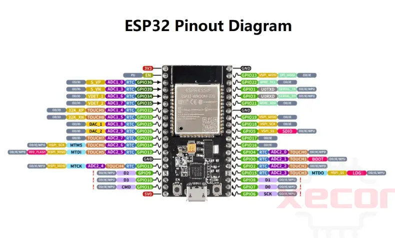

# ESP-DIF

1. Three LED lights blinking on and off, task increase the speed with a button. Add a semaphore to give some order (template task called **TaskBlink**)

1. Two new tasks: one to show the number of LEDs lit via an OLED display and other to show the watermark of each tasks at the begining (serial).

   

## API

- **delay.h** make use of ports.h

- **blink.h** make use of ports.h

- **command.h** --> serial parser and executer (semaphore and queue)

- pool, mbox and other tools for RTOS

  

## Pinouts

## TODO

Seguir [practicas](https://miot-rpi.github.io/practicas/ANIOT/P1/) de la UPM: Arquitectura de Nodos en IoT (ANIoT)

1. Blink with Delays
2. Blink with Timers
3. Tasks and events
4. Bus **I2C**

Project with a SHT sensor

- e_1 -> Uso de `i2ctools`
- e_2 -> Lectura de temperatura
- e_3 -> Uso de CRC en sensor
- e_4 -> Aplicación con FSM

**References**

- ESP32 [tutorial](https://medium.com/@tomw3115/implementing-freertos-solutions-on-esp-32-devices-using-arduino-114e05f7138a)
- Hardware: ESP32 Dev (WROOM), ESP-CAM
