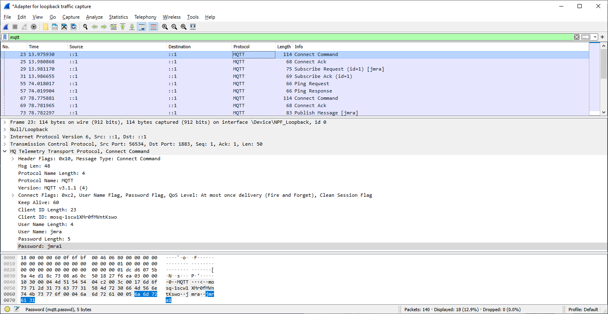

# WireSharck (IY1463)

MAC del destino cuya direccion es 192.168.1.1 (ARP)
Forzar para que la busque: eliminarla de la tabla local:

    $ arp -a
    $ arp -d 192.168.1.1

    $ ping 192.168.1.1
    $ lynx http:\\ip4.me

**Ejercicio Ping**

Desde la línea de comandos del PC1 ejecutar un ‘ping’ a la dirección del PC2, capturando con Wireshark los paquetes ARP e ICMP intercambiados entre ambos PCs. Analizar los resultados obtenidos (MACs, IPs, etc.). Asegurarse de que el PC1 no dispone de la MAC del PC2 en su tabla ARP.

**Ejercicio TCP**

Con la ayuda de la Hercules SETUP utility y la libreria C en cada uno de los dos PCs, crear un socket TCP-client en el PC1 y un TCP-server en el PC2. Activar el ‘listen’ en el server y a continuación ‘connect’ en el client. Una vez establecida la conexión entre ambos socket, enviar un mensaje desde el client al server y viceversa. Capturar con Wireshark el tráfico de red generado por los dos sockets y analizar los resultados obtenidos en la captura.

    $ netstat -B 
    $ lynx http:\\www.codeblocks.org
  
**Ejercicio UDP**

Ejecutar en Python los scripts Client y Server UDP. Capturar un paquete con Wireshark.

Con la ayuda de la Hercules SETUP utility en cada uno de los dos PCs, crear un socket UDP en el PC1 y un UDP en el PC2. En ambos PCs activar la escucha (listen) de los dos sockets UDP. Desde el PC1 enviar un datagrama a PC2 y viceversa. Capturar con Wireshark el tráfico de red generado por los dos sockets y analizar los resultados obtenidos en la captura.

**Ejercicio NTP**

Ejecutar el código Python anterior en el PC local y capturar los paquetes involucrados. Se puede observar como primero se solicita un servicio DNS para conocer la IP de ‘pool.ntp.org’ y a continuación un servicio NTP, que Wireshark decodifica en detalle

    $ python ntp.py
    Time = Mon Feb 13 2026

**Ejercicio MQTT**

## 202602

- Perception > Network (router) > App cloud
- publisher / subscribe : desacoplamiento temporal (broker)
- toleracion a desconexion
- REST: respresentational State Transfer (RESTFull services)
- Stateless: la API son metodos GET/POST
- Websockets: dashboards datos agregados
- CBOR = JSON en binario
