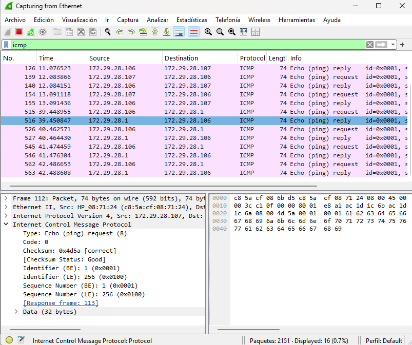
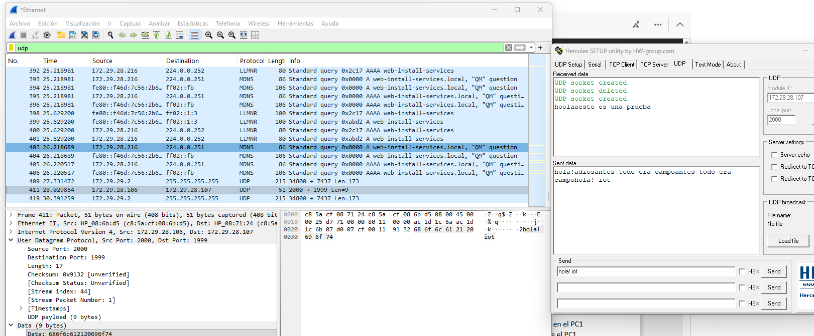
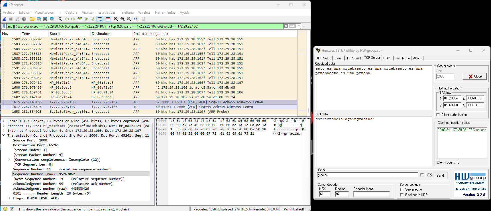
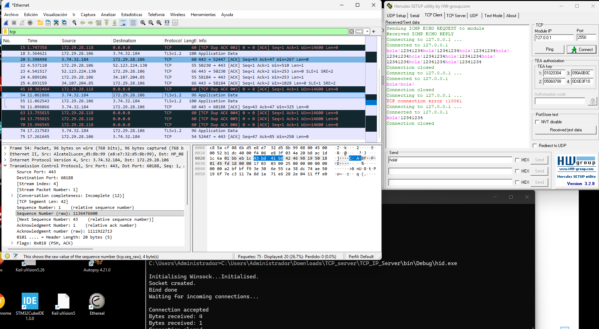
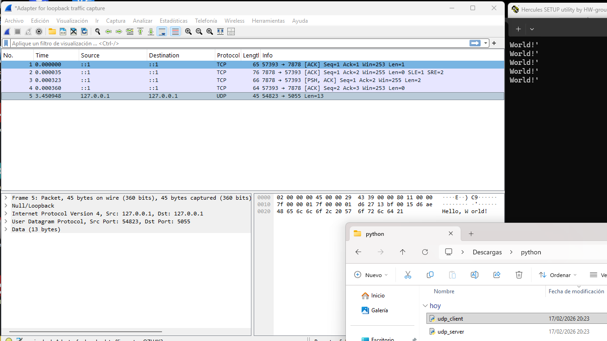

# WireSharck (1)

Juan Gago. Febrero/2026

**Ejercicio Ping**

Desde la línea de comandos del PC1 ejecutar un ‘ping’ a la dirección del PC2, capturando con Wireshark los paquetes ARP e ICMP intercambiados entre ambos PCs. Analizar los resultados obtenidos (MACs, IPs, etc.). 

Hemos comprobado que el PC1 (.106) no dispone de la MAC del PC2 (.107) en su tabla ARP con el comando:

    $ arp -a
    $ arp -d 172.29.28.107
    $ ping 172.29.28.107
    $ lynx http:\\ip4.me

**Ejercicio UDP: Hercules**

Con la ayuda de la Hercules SETUP utility en cada uno de los dos PCs, crear un socket UDP en el PC1 y un UDP en el PC2. En ambos PCs activar la escucha (listen) de los dos sockets UDP. Desde el PC1 enviar un datagrama a PC2 y viceversa. 

**Ejercicio TCP: Hercules**

Con la ayuda de la Hercules SETUP utility en cada uno de los dos PCs, crear un socket TCP-client en el PC1 y un TCP-server en el PC2. Activar el ‘listen’ en el server y a continuación ‘connect’ en el client. Una vez establecida la conexión entre ambos socket, enviar un mensaje desde el client al server y viceversa. 

**Ejercicio TCP: libreria en C**

Con la ayuda de la Hercules SETUP utility y la libreria C en cada uno de los dos PCs, crear un socket TCP-client en el PC1 y un TCP-server en el PC2. 

Podemos verificar que el ejecutable esta usando el puerto TCP con el siguient comando:

    $ netstat -B 

**Ejercicio UDP: Python script**

Ejecutar en Python los scripts Client y Server UDP. Capturar un paquete con Wireshark.

**Ejercicio NTP**

Ejecutar el código Python **ntp.py** en el PC local y capturar los paquetes involucrados. Se puede observar como primero se solicita un servicio DNS para conocer la IP de ‘pool.ntp.org’ y a continuación un servicio NTP, que Wireshark decodifica en detalle

    $ python ntp.py
    Time = Mon Feb 13 2026

